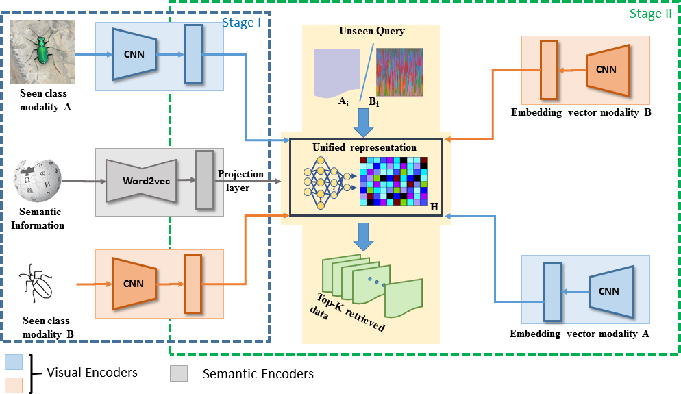
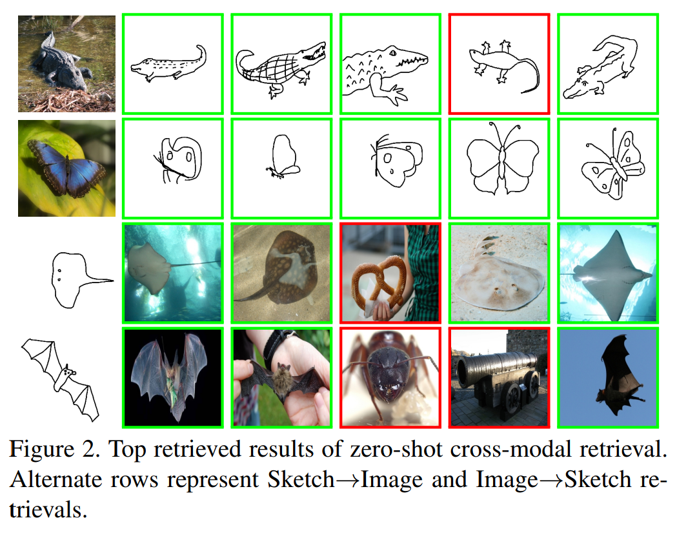

# A-Simplified-framework-for-Zero-shot-Cross-Modal-Sketch-Data-Retrieval
We deal with the problem of zero-shot cross-modal image retrieval involving color and sketch images through a novel deep representation learning technique. The problem of asketch to image retrieval and vice-versa is of practical importance, and a trained model in this respect is expected to generalize beyond the training classes, e.g., the zero-shot learning scenario. Nonetheless, considering the drastic distributions-gap between both the modalities, a feature alignment is necessary to learn a shared feature space where retrieval can efficiently be carried out. Additionally,it should also be guaranteed that the shared space is semantically meaningful to aid in the zero-shot retrieval task.The very few existing techniques for zero-shot sketch-RGB image retrieval extend the deep generative models for learning the embedding space; however, training a typical GAN-like model for multi-modal image data may be non-trivialat times. To this end, we propose a multi-stream encoder-decoder model that simultaneously ensures improved mapping between the RGB and sketch image spaces and high discrimination in the shared semantics-driven encoded feature space. Further, it is guaranteed that the class topology of the original semantic space is preserved in the encoded feature space, which subsequently reduces the model bias towards the training classes. Experimental results obtained on the benchmark Sketchy and TU-Berlin datasets establish the efficacy of our model as we outperform the existing state-of-the-art techniques by a considerable margin.



To implement the code:
<ol>

<li> If needed change the path of snapshots and summary folders by changing the ‘path’ variable in Unified_XY_triads.py

<li> For pretraining the X and Y modalities, get the code from the pre-training git repository and load this .mat file in the <b>UxUyLoader.py</b> file. </li>


<li> While in the master folder, run the <b>Unified_XY_triads.py</b> file (for terminal based, type ‘python Unified_XY_triads.py’ in terminal) </li> </ol>

 
### Paper

*    The paper is also available on CVF: [A Simplified Framework for Zero-shot Cross-Modal Sketch Data Retrieval](openaccess.thecvf.com/content_CVPRW_2020/papers/w8/Chaudhuri_A_Simplified_Framework_for_Zero-Shot_Cross-Modal_Sketch_Data_Retrieval_CVPRW_2020_paper.pdf)

*   Feel free to cite the author, if the work is any help to you:

```
@InProceedings{Chaudhuri_2020_CVPR_Workshops,
author = {Chaudhuri, Ushasi and Banerjee, Biplab and Bhattacharya, Avik and Datcu, Mihai},
title = {A Simplified Framework for Zero-Shot Cross-Modal Sketch Data Retrieval},
booktitle = {The IEEE/CVF Conference on Computer Vision and Pattern Recognition (CVPR) Workshops},
month = {June},
year = {2020}
} 


